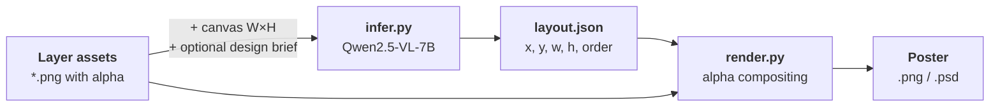

<div align="center">

# PosterCopilot: Toward Layout Reasoning and Controllable Editing for Professional Graphic Design

[Jiazhe Wei](https://jiazhewei.github.io/)1,\*, 
[Ken Li](https://kiyotakali.github.io/)1,\*, 
Tianyu Lao2, 
[Haofan Wang](https://haofanwang.github.io/)2, 
[Liang Wang](https://scholar.google.com/citations?user=8kzzUboAAAAJ&hl=en)1,3, 
[Caifeng Shan](https://caifeng-shan.github.io/)1, 
[Chenyang Si](https://chenyangsi.top/)1,†

1[PRLab, Nanjing University](https://prlab-nju.com/), 
2[LibLib.ai](https://www.lovart.ai/zh), 
3[Institute of Automation, Chinese Academy of Sciences](http://www.cripac.ia.ac.cn/CN/model/index.htm)

\*Equal Contribution, †Corresponding Author

[📄 Paper](https://arxiv.org/abs/2512.04082) | [🌐 Project Page](https://postercopilot.github.io/) | [▶️ Video](https://www.youtube.com/watch?v=yqFMzb5iVE8) | [💻 Code](https://github.com/JiazheWei/PosterCopilot) | [🤗 Model Weights](https://huggingface.co/void-2024/PosterCopilot)


</div>

---

## 🔥 News

- **[2026-06-18]** 🎉 PosterCopilot is accepted to **ECCV 2026**!
- **[2025-12-04]** Our paper is now available on [arXiv](https://arxiv.org/abs/2512.04082)!

---

## 🌟 Highlights

**PosterCopilot** is a cutting-edge framework that advances layout reasoning and controllable editing for professional graphic design using Large Multimodal Models (LMMs).


---

## ✨ Core Features

- **🎯 Geometrically Accurate Layouts**  
Achieves precise spatial positioning through a progressive three-stage training strategy that moves beyond simple regression to distribution-based learning
- **🎨 Aesthetic Reasoning**  
Instills human-like design principles and aesthetics through reinforcement learning from aesthetic feedback
- **✂️ Layer-level Control**  
Enables precise, fine-grained editing of individual layers while maintaining global visual consistency
- **🔄 Multi-round Iterative Editing**  
Supports professional iterative design workflows with multiple refinement rounds on specific elements
- **🎭 Versatile Applications**  
Handles complete layout generation, insufficient assets synthesis, theme switching, and canvas reframing

### 📈 Three-Stage Training Paradigm

1. **Perturbed Supervised Fine-Tuning (PSFT)**
  Reformulates coordinate regression into distribution-based learning for continuous spatial reasoning
2. **Reinforcement Learning for Visual-Reality Alignment (RL-VRA)**
  Introduces geometric reward signals to ensure visual-reality alignment and spatial accuracy
3. **Reinforcement Learning from Aesthetic Feedback (RLAF)**
  Employs learned aesthetic rewards to generate coherent and diverse compositions

### 📊 PosterCopilot Dataset

**One of the largest-scale, most thematically diverse, and highest-quality multi-layer poster datasets.**

- **160K posters** with **2.6M layers** (1.2M text + 1.4M image/decorative elements)
- Spans **40+ distinct domains** from commercial promotions to public announcements
- Novel OCR-based pipeline addresses over-segmentation challenges in multi-layer datasets

---

## 🔧 How It Works

You bring the layer assets and a canvas size. The model decides where every layer  
goes in the format of a JSON file, and the renderer composites them into the finished poster.   A renderer can be a simple assembly script or a full-fledged engine that utilizes complex keys such as blend modes. You can use the rendering script we provide in the code, which is sufficient to reproduce the model’s performance, or you can integrate your own rendering script.




The two stages are decoupled on purpose: the layout JSON is a plain, editable
document, so you can inspect it, tweak it by hand, or feed it to your own
renderer.

---

## 🚀 Quick Start

### Step 1 — Install

```bash
git clone https://github.com/JiazheWei/PosterCopilot.git
cd PosterCopilot

conda env create -f environment.yml
conda activate postercopilot
```

Prefer plain pip? `pip install -r requirements.txt` into any Python 3.10+ environment.

One optional extra:

```bash
# Faster attention kernel. Without it the model falls back to PyTorch SDPA.
pip install flash-attn==2.7.4.post1 --no-build-isolation
```

> **CUDA note.** `environment.yml` pins `torch==2.5.1`, a CUDA 12.4 build that
> works on any driver reporting CUDA ≥ 12.0. Do not blindly upgrade: torch
> ≥ 2.13 bundles CUDA 13 and silently loses the GPU on drivers older than 580.

### Step 2 — Get the weights

```bash
huggingface-cli download void-2024/PosterCopilot --local-dir checkpoints/postercopilot-7b
```

15.5 GiB across four shards. The checkpoint needs about **20 GB of free VRAM**
in bfloat16 at inference time.

The released checkpoint is trained on a reviewed, rights-cleared subset of the
corpus described below, and is published as a demonstration for the community.
Its layout behaviour tracks the full-data model closely.

### Step 3 — Prepare your layer assets

Put one file per layer in a folder. Transparency matters — the model reads each
layer's own pixels to infer its role, so export tight crops with alpha intact.

```
my_layers/
├── 0_background.png
├── 1_photo.png
├── 2_headline.png
├── 3_body.png
└── 4_logo.png
```

Files are sorted in natural filename order, and **that order is the `image_id`
numbering** the model sees and reports back. Number your files if you care which
id maps to which layer. `.png`, `.jpg`, `.jpeg`, `.webp` and `.bmp` are picked up.

> **Nothing to hand yet?** [`examples/`](examples) ships three decomposed
> posters — layers, predicted layouts and rendered results — so you can run the
> pipeline straight away.

### Step 4 — Generate the layout

```bash
python infer.py \
    --model checkpoints/postercopilot-7b \
    --assets ./my_layers \
    --width 1200 --height 1600 \
    -o layout.json
```

Steer the composition with a plain-language brief:

```bash
python infer.py ... --requirement "Bold headline top-left, product shot bottom-right"
```

### Step 5 — Render the poster

```bash
python render.py --layout layout.json --assets ./my_layers -o poster.png
```

Useful variants:

```bash
# composite onto white and save RGB
python render.py ... --background white --flatten

# keep each layer's own aspect ratio instead of filling the predicted box
python render.py ... --resize contain

# also write an editable PSD, one pixel layer per asset
python render.py ... --psd
```

Rendering imports nothing but Pillow, so a machine with no model runtime can
still turn layouts into posters.

---

## 📐 Layout JSON

The contract between the two stages:

```jsonc
{
  "canvas_size": { "width": 1200, "height": 1600 },
  "layers": [
    { "image_id": 4, "category": "image", "x": 112, "y": 90,  "w": 390,  "h": 131,  "order": 0 },
    { "image_id": 0, "category": "image", "x": 0,   "y": 0,   "w": 1200, "h": 1600, "order": 4 }
  ],
  "image_id": [
    { "id": 0, "image": "0_background.png" },
    { "id": 4, "image": "4_logo.png" }
  ]
}
```


| Field              | Meaning                                                                                           |
| ------------------ | ------------------------------------------------------------------------------------------------- |
| `order`            | **Lower is closer to the viewer.** The renderer paints back-to-front, i.e. in descending `order`. |
| `x`, `y`, `w`, `h` | Top-left anchored, in canvas pixels. Each source layer is scaled to `w` × `h`.                    |
| `category`         | `type` for text layers, `image` for everything else.                                              |
| `image_id` (root)  | Maps each `id` to a filename, relative to the assets folder, so the document stays portable.      |


Because it is just JSON, hand-editing a coordinate and re-running `render.py`
takes a second — no model involved.

---

## ⚙️ Options

`**infer.py`**


| Flag                     | Default             | Notes                                                               |
| ------------------------ | ------------------- | ------------------------------------------------------------------- |
| `--assets DIR [DIR ...]` | required            | Several folders reuse one model load; `-o` then becomes a directory |
| `--width` / `--height`   | required            | Canvas size in pixels                                               |
| `--requirement`          | empty               | Free-form design brief                                              |
| `--device`               | `cuda`              | e.g. `cuda:0`, `cpu`                                                |
| `--dtype`                | `bfloat16`          | `float16`, `float32`                                                |
| `--attn`                 | `auto`              | `auto` picks `flash_attention_2` when installed, else `sdpa`        |
| `--max-new-tokens`       | `72 × layers + 128` | Measured budget; generation stops at EOS                            |
| `--print-raw`            | off                 | Echo the raw decoder output                                         |


`**render.py**`


| Flag                       | Default         | Notes                                                               |
| -------------------------- | --------------- | ------------------------------------------------------------------- |
| `--layout JSON [JSON ...]` | required        | Batch renders when given several                                    |
| `--assets DIR`             | layout's folder | Where the layer files live                                          |
| `--resize`                 | `stretch`       | `stretch` fills the predicted box; `contain` preserves aspect ratio |
| `--background`             | `none`          | `white`, `black`, `#RRGGBB[AA]`                                     |
| `--flatten`                | off             | Composite onto white, save RGB                                      |
| `--psd`                    | off             | Editable PSD alongside the PNG (needs `psd-tools`)                  |


Layers whose file is missing, whose box is degenerate, or whose `image_id` the
model invented are skipped with a warning rather than aborting the render.
Boxes running off the canvas are drawn and clipped, and warned about.

**Notes on preprocessing and reproducibility**

**Preprocessing is fixed.** Each layer is flattened onto an automatically chosen
black-or-white background (whichever contrasts with its dominant colour), scaled
to a 28-pixel-aligned canvas inside a 15680–56448 pixel budget, and letterboxed
with grey `(128, 128, 128)`. The system prompt tells the model to reason about
the original aspect ratio and ignore the grey bars. This is exactly the pipeline
used during training; `postercopilot/constants.py` pins the numbers, and
changing them costs layout quality without raising an error.

**Greedy is not deterministic across environments.** Coordinates are emitted
digit by digit, so one flipped digit re-rolls the rest of the layout. In
bfloat16 those flips are not rare — on one measured sample the choice between
`"h": 58` and `"h": 114` was an exact tie in the reference forward pass. Expect
different-but-comparable layouts when you change GPU, dtype, attention kernel,
or `--no-kv-cache`. Pin the whole stack to reproduce specific numbers, use
`--dtype float32` to make ties rarer, and evaluate over a set of samples rather
than a single generation.


---

## 🗂️ Repository Layout

```
infer.py                  layer assets  ->  layout JSON
render.py                 layout JSON   ->  poster image
examples/                 three runnable cases + a step-by-step walkthrough
postercopilot/
  assets.py               folder -> image_id assignment
  constants.py            frozen preprocessing constants
  image_processing.py     auto-background, letterboxing, token budget
  postprocess.py          JSON extraction, normalisation, validation
  predictor.py            checkpoint loading and generation
  prompts.py              system prompt and user turn
  rendering.py            alpha compositing and PSD export
```

---

## 📝 Citation

If you find PosterCopilot useful for your research, please consider citing:

```bibtex
@article{wei2025postercopilot,
  title={PosterCopilot: Toward Layout Reasoning and Controllable Editing for Professional Graphic Design},
  author={Wei, Jiazhe and Li, Ken and Lao, Tianyu and Wang, Haofan and Wang, Liang and Shan, Caifeng and Si, Chenyang},
  journal={arXiv preprint arXiv:2512.04082},
  year={2025}
}
```

---

## 📧 Contact

For questions and collaborations, please contact:

- Jiazhe Wei: [jzw6545@gmail.com](mailto:jzw6545@gmail.com)
- Ken Li: [kiyotakali075@gmail.com](mailto:kiyotakali075@gmail.com)
- Chenyang Si: [chenyangsi@smail.nju.edu.cn](mailto:chenyangsi@smail.nju.edu.cn)

---

## 🙏 Acknowledgments

We thank all contributors for their valuable feedback, and Lovart.ai for their heartwarming support throughout all the process. And special thanks for all researchers who have been following PosterCopilot since the demo was released. 

© 2025 PosterCopilot project. Released under the Apache 2.0 License.